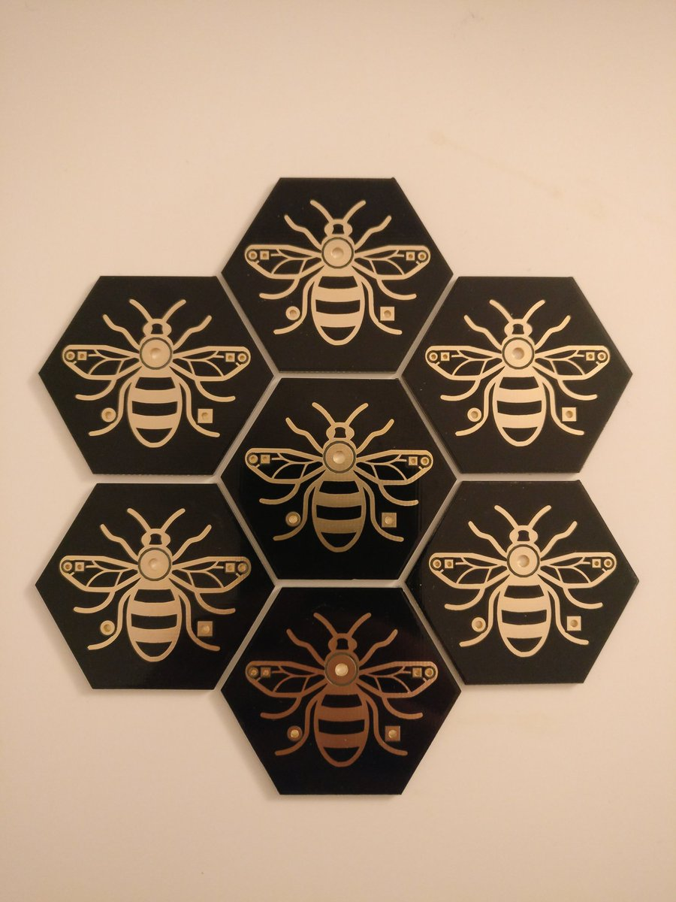

# PCbee
Mancunian themed wearable badge and nice "my first soldering" project.

## Design
Designed in Kicad with the help of @GregNGM.

## Reference
The Mancehster Bee has been a symbol of Manchester since the industrial revolution.